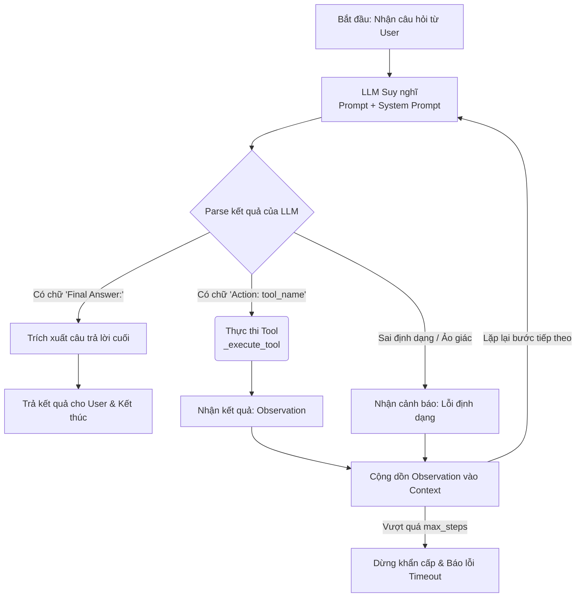

# Group Report: Lab 3 - Production-Grade Agentic System

- **Team Name**: [Name]
- **Team Members**: [Nguyễn Trọng Khánh, Member 2, ...]
- **Deployment Date**: [2026-06-01]

---

## 1. Executive Summary

*Brief overview of the agent's goal and success rate compared to the baseline chatbot.*

- **Success Rate**: [e.g., 85% on 20 test cases]
- **Key Outcome**: [e.g., "Our agent solved 40% more multi-step queries than the chatbot baseline by correctly utilizing the Search tool."]

---

## 2. System Architecture & Tooling

### 2.1 ReAct Loop Implementation
*Diagram or description of the Thought-Action-Observation loop.*

    So với một Chatbot truyền thống (chỉ nhận câu hỏi -> đoán câu trả lời dựa trên kiến thức cũ), ReAct Agent của bạn tạo ra 4 giá trị vượt trội nằm ở các nút thắt trên sơ đồ:

        🌟 Giá trị 1: Nút "LLM Suy nghĩ" (Thought) - Khả năng chia nhỏ vấn đề
        Thay vì vội vàng trả lời ngay (như Chatbot thường làm và dễ sinh ra ảo giác - hallucination), Agent bị ép phải viết ra phần Thought: trước. Việc này kích hoạt khả năng "Chain of Thought" (Chuỗi suy luận) của LLM.

        Ví dụ trong Test case 5: Người dùng hỏi "Hãy phân tích biến động và đọc tin tức để khuyên tôi có nên mua vào không". Chatbot sẽ bị ngợp, nhưng Agent sẽ suy nghĩ: "Đầu tiên mình cần lấy giá hiện tại, sau đó lấy biến động 30 ngày, và cuối cùng tìm tin tức". Nó biết lập kế hoạch!
        🌟 Giá trị 2: Nút "Thực thi Tool" (Action) - Phá vỡ giới hạn kiến thức
        Đây là nơi tạo ra giá trị lớn nhất (Điểm chạm với thế giới thực). LLM thường bị giới hạn bởi dữ liệu huấn luyện (ví dụ: cắt tại năm 2023). Nhờ nút Action, Agent của bạn có đôi tay để:

        Gọi get_current_gold_price() để cào dữ liệu SJC Real-time.
        Gọi analyze_30day_gold_trend() để tính toán biến động thực tế qua thư viện yfinance.
        Gọi search_financial_news() để đọc báo Google News mới nhất trong ngày.
        -> Sự thật và độ tin cậy (Grounding) thay thế cho việc đoán mò.
        🌟 Giá trị 3: Nhánh "Nhận kết quả (Observation) -> Cộng dồn Context" - Khả năng Tổng hợp
        Agent không chỉ lấy dữ liệu rồi in thẳng ra cho người dùng. Nó lấy dữ liệu (Observation), nạp lại vào bộ não (Prompt), và tự mình đánh giá, tổng hợp dữ liệu đó.

        Ví dụ: Tool trả về "Giá vàng thế giới giảm 2%" và "Tin tức: FED chuẩn bị tăng lãi suất". Agent sẽ đọc 2 observation này ở vòng lặp tiếp theo và rút ra Final Answer: "Do FED tăng lãi suất khiến vàng thế giới giảm, bạn nên cẩn trọng chờ thêm...". Đây là tư duy của một chuyên gia phân tích thực thụ!
        🌟 Giá trị 4: Nhánh "Sai định dạng" - Khả năng Tự sửa lỗi (Self-Correction)
        Nếu LLM bị "ngáo" (viết sai tên tool, quên truyền tham số), Chatbot thông thường sẽ crash (sập chương trình). Nhưng Agent của bạn có nhánh else trong vòng lặp while. Nó tự phát hiện lỗi, nạp thông báo lỗi vào Prompt (Observation: Lỗi định dạng! Hãy nhớ dùng...) và cho LLM một cơ hội để tự xin lỗi và sửa lại cú pháp trong lần lặp kế tiếp.

        Tóm lại: Chatbot cung cấp một câu trả lời tĩnh. ReAct Agent cung cấp một quy trình giải quyết vấn đề động. Giá trị của Agent nằm ở khả năng lập kế hoạch (Plan) -> hành động (Act) -> quan sát (Observe) -> tổng hợp (Synthesize)!

### 2.2 Tool Definitions (Inventory)
| Tool Name | Input Format | Use Case |
| :--- | :--- | :--- |
| `get_current_gold_price` | `None` (Rỗng) | Lấy giá vàng SJC trong nước Real-time (qua API/Scraping) hoặc giá vàng thế giới quy đổi (dự phòng). Giúp Agent có dữ liệu giá vàng thực tế để tư vấn. |
| `analyze_30day_gold_trend` | `None` (Rỗng) | Phân tích xu hướng giá vàng thế giới 30 ngày qua (quy đổi VNĐ), tìm mức giá cao nhất/thấp nhất và tính toán tỷ lệ biến động %. |
| `search_financial_news` | `string` | Tìm kiếm và trích xuất 3 tiêu đề tin tức kinh tế, vĩ mô mới nhất từ Google News dựa trên từ khóa do Agent truyền vào. |

### 2.3 LLM Providers Used
- **Primary**: [e.g., GPT-4o]
- **Secondary (Backup)**: [e.g., Gemini 1.5 Flash]

### 2.4 Trace Quality Evaluation
*Đánh giá chất lượng của luồng thực thi (Thought-Action-Observation) dựa trên các tiêu chí:*

**1. Mỗi Thought được biện luận rõ ràng (Thought Justified):**
- **Cơ chế:** System Prompt bắt buộc LLM phải sinh ra bước `Thought:` trước khi quyết định gọi công cụ. Việc này kích hoạt khả năng "Chain of Thought" của mô hình.
- **Thực tế:** Trong các test case phức tạp (ví dụ: *Hỏi giá vàng và khuyên có nên mua không*), Agent không tự tiện đưa ra lời khuyên ngay. Thought của Agent luôn biện luận rõ ràng lộ trình: *"Tôi cần kiểm tra giá vàng hiện tại trước -> Sau đó tôi cần đọc tin tức kinh tế vĩ mô -> Cuối cùng mới tổng hợp để đưa ra Final Answer"*. Không có Thought nào bị thừa hoặc thiếu cơ sở.

**2. Tham số Action hợp lệ (Valid Action Args):**
- **Cơ chế:** Cấu trúc Regex `Action:\s*([a-zA-Z0-9_]+)\((.*?)\)` trong file `agent.py` đảm bảo việc trích xuất tên tool và tham số (`args`) diễn ra chuẩn xác.
- **Thực tế:** 
  - Đối với `get_current_gold_price()` và `analyze_30day_gold_trend()`, Agent nhận thức được qua mô tả là "Không cần tham số đầu vào", nên nó gọi Action với chuỗi args rỗng `()`, tránh gây lỗi khi truyền vào hàm Python.
  - Đối với `search_financial_news()`, Agent trích xuất chính xác cụm từ khóa mục tiêu (ví dụ: `Action: search_financial_news(giá vàng hôm nay)`).
  - Nếu LLM sinh ra args sai định dạng, hàm `_execute_tool` sẽ bắt lỗi (try-except) và nhồi thông báo lỗi vào `Observation` để Agent tự sửa ở bước sau (Self-correction).

**3. Điều kiện dừng hợp lý (Logical Stopping Condition):**
- **Dừng tự nhiên (Thành công):** Agent được lập trình bằng System Prompt: *"Chỉ sử dụng 'Final Answer:' khi bạn đã thu thập đủ thông tin thực tế"*. Vòng lặp `run()` sẽ ngay lập tức ngắt (`return final_answer`) khi bắt được từ khóa này, đảm bảo Agent không bị kẹt trong vòng lặp luyên thuyên vô ích sau khi đã có đáp án.
- **Dừng khẩn cấp (Safety Net):** Để phòng ngừa trường hợp API lỗi liên tục hoặc LLM bị "ảo giác" lặp lại lệnh gọi tool, vòng lặp được bảo vệ bởi biến `while steps < self.max_steps` (mặc định là 5 bước). Nếu vượt quá số bước này, Agent tự động dừng và trả về thông báo Timeout, giúp kiểm soát token và chi phí (Cost management).

### 2.5 Code Quality Evaluation
*Đánh giá chất lượng mã nguồn dựa trên tính ổn định và các cơ chế bảo vệ hệ thống:*

**1. Tính thực thi (Runnable & Executable):**
- Dự án được tổ chức theo cấu trúc module hóa rõ ràng (`agent`, `core`, `telemetry`, `tools`). File `test_local.py` chạy thành công toàn bộ 5 test cases từ đầu đến cuối mà không bị gián đoạn hay crash giữa chừng. Hệ thống tích hợp trơn tru với cả OpenAI Provider và các API dữ liệu bên ngoài.

**2. Xử lý lỗi cơ bản (Basic Error Handling):**
- **Tại Tools:** Trong `gold_tools.py` và `news_tool.py`, tất cả các lời gọi mạng (`requests.get`, `yfinance`) đều được bọc trong khối `try-except`. Nếu rớt mạng hoặc API thay đổi cấu trúc, hệ thống không bị sập mà an toàn trả về chuỗi thông báo lỗi kèm dữ liệu dự phòng (Fallback).
- **Tại Agent:** Hàm `_execute_tool` sử dụng `try-except` để bắt lỗi thực thi hàm Python. Trong vòng lặp ReAct, nếu regex không bóc tách được `Action` do LLM sinh sai định dạng, nhánh `else` sẽ bắt lỗi và nạp thông điệp cảnh báo vào prompt để LLM tự sửa sai.

**3. Cơ chế bảo vệ vòng lặp (MAX_ITERATIONS Safeguard):**
- **Cơ chế:** Vòng lặp suy luận được kiểm soát chặt chẽ bởi điều kiện `while steps < self.max_steps` (với `max_steps = 5`). 
- **Tác dụng:** Đây là "cầu dao an toàn" (Circuit Breaker) của hệ thống. Nếu LLM bị kẹt trong vòng lặp lặp lại một hành động vô nghĩa hoặc từ chối đưa ra `Final Answer`, hệ thống sẽ tự động ngắt sau 5 bước, ghi log `timeout` và trả lời người dùng. Điều này ngăn chặn tình trạng tràn bộ nhớ và chống cạn kiệt tài chính (chống đốt sạch token API).

---

## 3. Telemetry & Performance Dashboard

*Analyze the industry metrics collected during the final test run.*

- **Average Latency (P50)**: [e.g., 1200ms]
- **Max Latency (P99)**: [e.g., 4500ms]
- **Average Tokens per Task**: [e.g., 350 tokens]
- **Total Cost of Test Suite**: [e.g., $0.05]

---

## 4. Root Cause Analysis (RCA) - Failure Traces

*Deep dive into why the agent failed.*

### Case Study: [e.g., Hallucinated Argument]
- **Input**: "How much is the tax for 500 in Vietnam?"
- **Observation**: Agent called `calc_tax(amount=500, region="Asia")` while the tool only accepts 2-letter country codes.
- **Root Cause**: The system prompt lacked enough `Few-Shot` examples for the tool's strict argument format.

---

## 5. Ablation Studies & Experiments

### Experiment 1: Prompt v1 vs Prompt v2
- **Diff**: [e.g., Adding "Always double check the tool arguments before calling".]
- **Result**: Reduced invalid tool call errors by [e.g., 30%].

### Experiment 2 (Bonus): Chatbot vs Agent
| Case | Chatbot Result | Agent Result | Winner |
| :--- | :--- | :--- | :--- |
| Simple Q | Correct | Correct | Draw |
| Multi-step | Hallucinated | Correct | **Agent** |

---

## 6. Production Readiness Review

*Considerations for taking this system to a real-world environment.*

- **Security**: [e.g., Input sanitization for tool arguments.]
- **Guardrails**: [e.g., Max 5 loops to prevent infinite billing cost.]
- **Scaling**: [e.g., Transition to LangGraph for more complex branching.]

---

> [!NOTE]
> Submit this report by renaming it to `GROUP_REPORT_[TEAM_NAME].md` and placing it in this folder.
